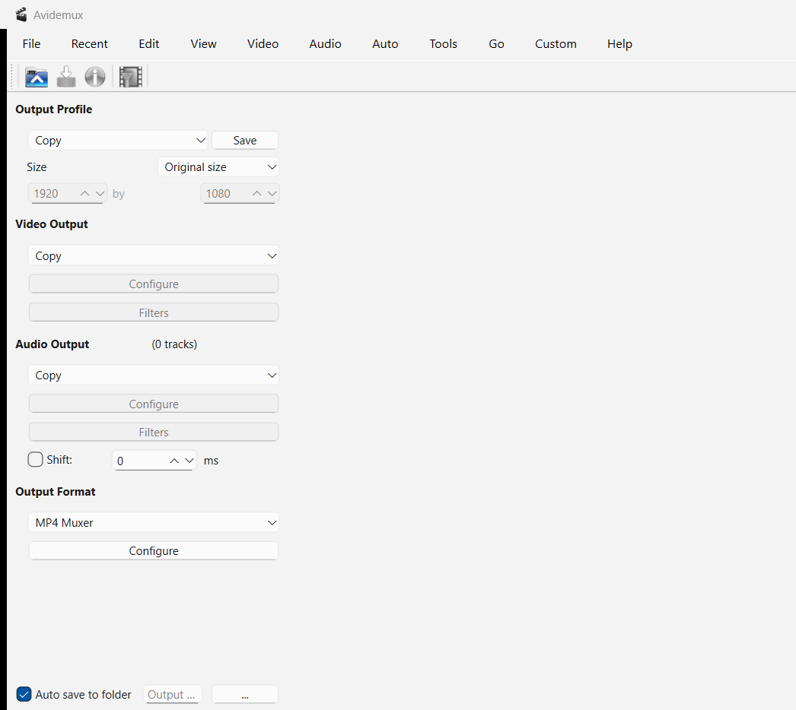
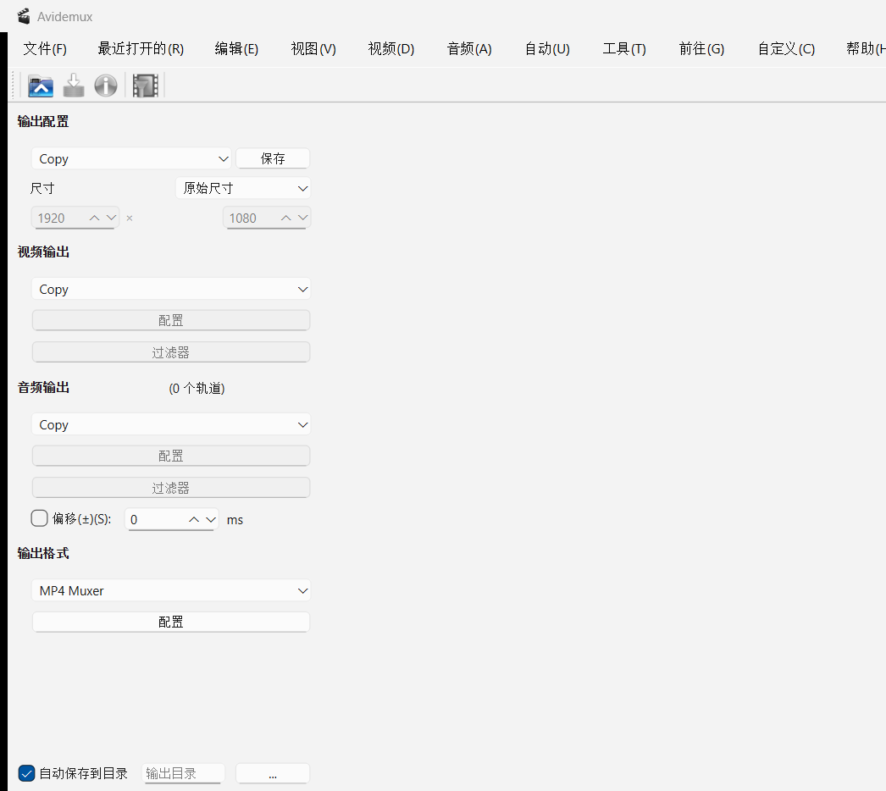

# Avidemux Windows 自定义增强版

English version: [README_CUSTOM_EN.md](README_CUSTOM_EN.md)

这个分支基于 Avidemux，面向 Windows 构建加入了一组工作流增强：快速封装、按 Profile 自动选择编码参数、可预测的输出命名、自动保存目录，以及 x264/x265 支持。

## 截图

英文界面：



简体中文界面：



## 主要增强

### 输出 Profile 工作流

在原有视频、音频、封装格式设置上方新增 **输出配置** 选择器。选择一个 Profile 后会自动设置：

- 视频编码器；
- 音频编码器；
- 输出封装格式；
- 可选缩放模式；
- 可用时自动套用编码器 preset/profile。

内置 Profile 包括：

- `Copy`
- `DivX HEVC 1080p`
- `DivX HEVC 720p`
- `DivX Plus 4K`
- `DivX Plus HD`
- `MP4 iPad`
- `MP4 iPhone`

默认 Profile 是 `Copy`，默认保留原始视频/音频流，只有用户选择编码 Profile 时才进入编码模式。

### 保存自定义 Profile

可以通过 Profile 选择器旁边的 **保存** 按钮，把当前输出设置保存为自定义输出 Profile。

自定义 Profile 会保存：

- 当前视频编码器；
- 当前音频编码器；
- 当前封装格式；
- 缩放模式；
- 目标宽度和高度。

### 缩放模式

Profile 不会强制缩放，除非选择的尺寸模式需要缩放。尺寸模式支持：

- 原始尺寸；
- Profile 尺寸，保持宽高比；
- 自定义尺寸，保持宽高比；
- 自定义尺寸，拉伸。

当选择“自定义尺寸，保持宽高比”时，输入宽度会自动计算高度，输入高度也会自动计算宽度，比例来自当前打开的视频。

### 打开视频后自动 fit 到当前显示区域

打开视频时会自动把视频适配到当前视频显示区域。这里是“视频 fit 到现有窗口”，不是让窗口跟随视频尺寸变化。

### 默认输出格式改为 MP4

默认输出封装格式改为 MP4 muxer。

### 可预测的输出命名

默认保存文件名不再使用 `_edit`。

Copy 模式：

```text
source-001.mp4
source-002.mp4
source-003.mp4
```

编码模式：

```text
source-720p-h264.mp4
source-720p-h264-001.mp4
source-360p-hevc.mp4
```

分辨率后缀取最终输出高度。编码器后缀只区分视频编码器，例如 x264 使用 `h264`，x265 使用 `hevc`。

### 自动保存到目录

主输出面板底部新增 **自动保存到目录** 选项。

- 勾选：直接保存到指定目录，并使用自动命名规则；
- 未勾选：弹出常规保存对话框，但默认文件名仍使用自动命名规则。

### x264 / x265 支持

该自定义构建为 Windows 构建环境加入 x264 和 x265 编码器支持，并增加 DivX 风格的 preset JSON 配置。

### 本机调优

x264/x265 preset 针对本机构建目标做了调优，包含适配 Ryzen 7 4800U 级别 8C/16T CPU 的显式线程参数。

### 英文 / 简体中文 / 繁体中文自定义 UI 文案

该分支新增的自定义 UI 文案支持：

- English；
- 简体中文；
- 繁体中文。

语言优先跟随 Avidemux 自身语言偏好；如果偏好为 `auto`，则回退到系统 locale。

## Windows Build

本分支只面向 Windows x86-64 构建，不需要构建 x86 32-bit 版本。

### 构建环境

已验证环境：

- Windows x86-64；
- Visual Studio 2022 Build Tools / MSVC；
- CMake；
- Ninja；
- Qt 6.8.3 MSVC 2022 x64；
- MSYS2，用于提供 x264 / x265 相关依赖；
- GitHub CLI / Git，仅用于源码管理和推送。

建议 Qt 安装路径示例：

```text
D:\Qt\6.8.3\msvc2022_64
```

### 拉取源码

```powershell
git clone https://github.com/<your-user>/avidemux2.git
cd avidemux2
git checkout custom-windows-enhancements
```

如果网络需要代理，可以使用本机 HTTP/HTTPS 代理：

```powershell
git config --global http.proxy http://127.0.0.1:7890
git config --global https.proxy http://127.0.0.1:7890
```

### 构建主程序

在 “x64 Native Tools Command Prompt for VS 2022” 或已加载 VS DevCmd 的 PowerShell / cmd 中构建。

示例命令：

```cmd
set QTDIR=D:\Qt\6.8.3\msvc2022_64
set PATH=C:\Program Files\CMake\bin;D:\Qt\6.8.3\msvc2022_64\bin;C:\msys64\usr\bin;%PATH%
call "C:\Program Files (x86)\Microsoft Visual Studio\2022\BuildTools\Common7\Tools\VsDevCmd.bat" -arch=x64
cmake --build build\qt-msvc2 --config Release --target install --parallel 8
```

如果 x264 / x265 preset 或插件相关内容有变更，需要同步构建插件：

```cmd
cmake --build build\plugins-msvc-x26x3 --config Release --target install --parallel 8
```

### 制作 dist 目录

```cmd
xcopy /E /I /Y install\* dist\
D:\Qt\6.8.3\msvc2022_64\bin\windeployqt.exe --release --no-compiler-runtime --no-opengl-sw dist\avidemux.exe
```

清理开发文件，避免把 `.lib` 和 `include/` 打入分发包：

```cmd
if exist dist\include rmdir /s /q dist\include
del /s /q dist\*.lib
```

### 压缩分发包

```powershell
Compress-Archive -Path .\dist\* -DestinationPath .\avidemux-custom-dist.zip -CompressionLevel Optimal
```

### 基本验证

```powershell
$env:Path = "$(Resolve-Path .\dist);" + $env:Path
.\dist\avidemux.exe --nogui --video-codec x264 --quit
.\dist\avidemux.exe --nogui --video-codec x265 --quit
```

两个命令退出码为 `0` 时，表示 x264 / x265 插件可正常加载。

## 构建验证

已在 Windows x86-64、MSVC、Qt 6.8.3 环境下本地验证：

- GUI 构建成功；
- x264 编码器加载成功；
- x265 编码器加载成功；
- 生成的分发包排除了 `.lib` 和 `include/` 等开发文件。

## 说明

这个分支面向个人 Windows 自定义构建。一些行为，例如输出命名规则和本机 CPU 调优，是有明确个人偏好的设计，不一定适合原样合并到 Avidemux 上游。
